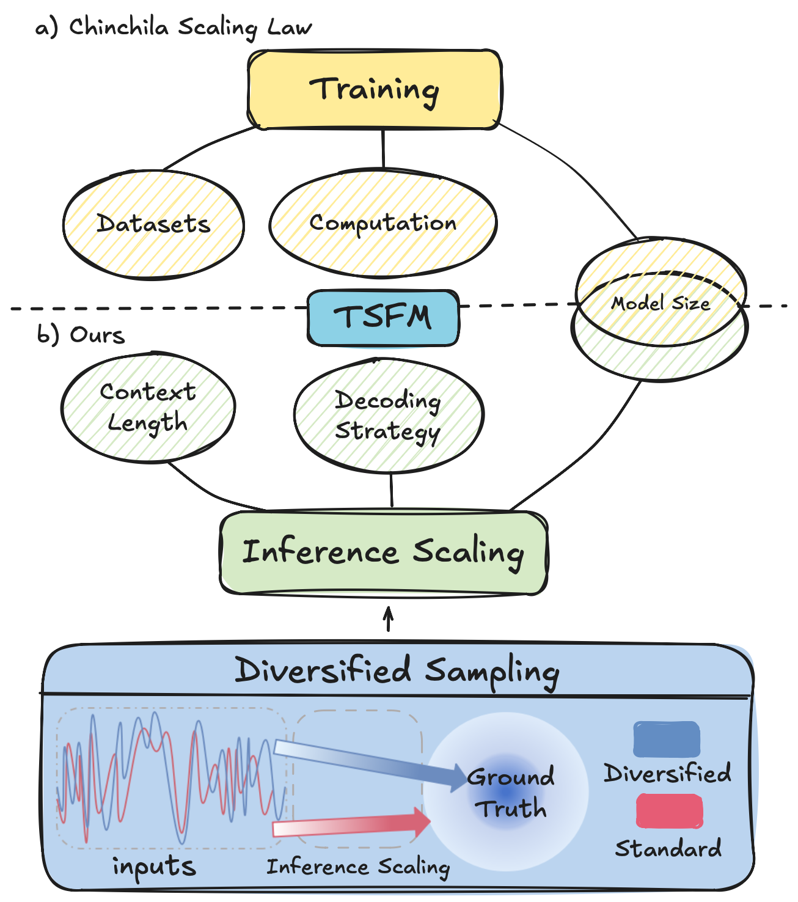

# <p align=center> `Diversified Scaling Inference in TSFMs`</p>

## Introduction
This repository provides the official implementation and evaluation pipeline for *Diversified Scaling Inference in Time Series Foundation Models*, focusing on inference scaling via controlled time series perturbations. The code supports multiple TSFMs and datasets, enabling large-scale parallel inference without any fine-tuning.

<p align="center">
  
</p>

## How to run

### 1. Configuration Requirements

**Environment**

- **Python** ≥ 3.9
- **PyTorch** ≥ 2.0
- **GPU:** CUDA-enabled GPU is strongly recommended for testing TSFMs

**Dependency Installation**

Install all required dependencies via:

```bash
bash setup.sh
```

### 2. Model and Dataset Preparation

**TSFMs**

- [Chronos](https://github.com/amazon-science/chronos-forecasting)
- [TimeFM](https://github.com/google-research/timesfm)
- [Moirai](https://github.com/SalesforceAIResearch/uni2ts)
- [Time-MoE](https://github.com/Time-MoE/Time-MoE)

**Datasets**

- [ETTh1, ETTm1, Electricity, and Traffic](https://github.com/thuml/Time-Series-Library)

**Dataset Preparation**

Place all datasets under the project root directory, which will be unzip by `setup.sh`:

```text
dataset/
 └── ETT-small/
     └── ETTh1.csv
```

**Supported Perturbation**
* *Structural Perturbations*: prefix,insert,suffix
* *Noise Perturbations*: missing_data,gaussian_noise,random_offset_noise
* *Task-specific Perturbations*: task_sensitive,task_dependent,task_reconstruct

for the more pertubation you want to set, please enroll in the file `./src/disturb_function.py`.

### 3. Running the Pipeline

All experiments are driven by the main entry script:

```bash
python disturb_run_pipeline.py <arguments>
```

This script performs sliding-window forecasting, disturbance injection, and metric aggregation in a single pipeline.

**Key Arguments**

| Argument | Description                                                                                            |
| -------- | ------------------------------------------------------------------------------------------------------ |
| `-m`     | Model name (e.g., `chronos-t5-small`, `timesfm-2.5-200m-pytorch`, `moirai-1.1-R-small`, `TimeMoE-50M`) |
| `-data`  | Dataset name (`ETTh1`, `ETTm1`, `electricity`, `traffic`)                                              |
| `-d`     | perturbation type                                                                                      |
| `-sn`    | Sampling index for diversified inference (used for large-scale parallel runs)                          |
| `-n`     | Number of samples(e.g., 64)                                                                            |
| `-i`     | Input length (32, 64, 128, 256, 512, 1024)                                                             |
| `-t`     | Sampling temperature                                                                                   |
| `-dw`    | Enable disturbance-wise aggregation (`true / false`)                                                   |
| `-dir`   | Output directory for prediction results                                                                |


The main experments we evaluated is by **parallel large-scale inference** at:
```bash
bash run.sh
```

### 4. Examples

**Example 1: Multi-sample Inference Scaling (TimesFM)**

```bash
CUDA_VISIBLE_DEVICES=0 python disturb_run_pipeline.py \
  -m timesfm-2.5-200m-pytorch \
  -data ETTh1 \
  -d gaussian_noise \
  -n 128 \
  -dir ./results/predictions_gaussian_
```

This performs one diversified inference sample (sn=32) under Gaussian noise perturbation.

**Example 2: Single-sample Inference by a index (Chronos)**

```bash
CUDA_VISIBLE_DEVICES=0 python disturb_run_pipeline.py \
  -m chronos-t5-base \
  -data electricity \
  -d task_sensitive \
  -sn 1 \
  -dir ./results/predictions_
```


This setup reproduces **inference-time scaling curves** under diversified perturbations.

## Plot and RobustMSE

After all diversified inputs in TSFMs are inference, all the figures can be plotted in the dir `plotting/`, and you are easy to compute RobustMSE by `plotting/plot_robustmse.py`.